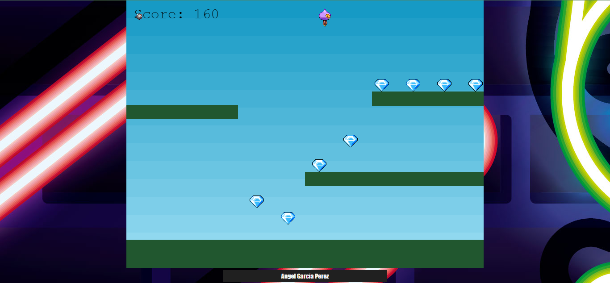
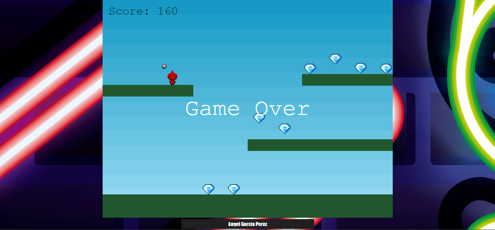

# Juego de plataformas con Phaser

Juego realizado con phaser el cual consiste en un juego de plataformas
en el que el personaje va coleccionando items (diamantes) y evadiendo 
los obstaculos presentados en el juego.

El juego inicia con el personaje principal presentado en la pantalla, asi como
los items a recoger y la puntuacion.

Podemos mover al personaje hacia la izquierda, derecha y hacer que salte

Una vez se pasa el "primer nivel" sube la dificultad del juego añadiendo
obstaculos los cuales si llegan a tocar a nuestro personaje sera el final
del juego.

Aqui podemos ver un resultado de "Game Over"
